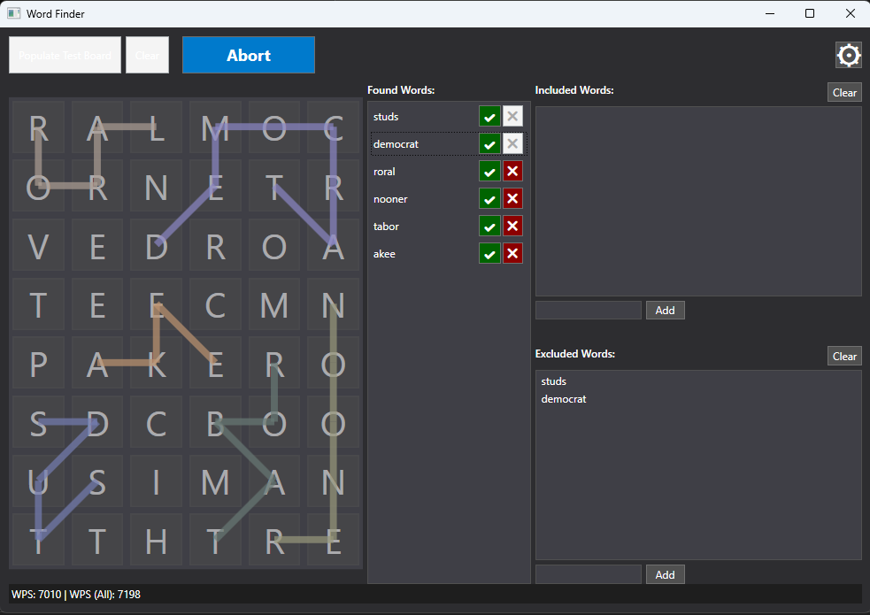
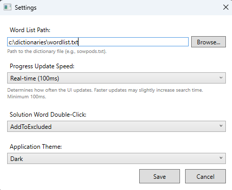

# Word Grid Solver

Welcome to the Word Grid Solver Application! This tool is designed to assist users in solving grid-based word search puzzles where words are formed by tracing paths through adjacent letters.

## Overview

This application provides an interactive way to identify and manage words on a letter grid. Users can input a letter grid, and the solver will find potential words with the aim of covering every tile on the board with a different word. Users can then guide the solver by marking words as included or excluded from the solution, iteratively refining the results until the puzzle is solved.

## Getting a Word List (Dictionary File)

**Important**: This application requires a word list file (a plain text `.txt` file with one word per line) to function.

Due to copyright and licensing restrictions on many common word lists (like SOWPODS/TWL), a default dictionary file is **not** included with this application. You will need to provide your own.

**Where to find word lists:**

*   Search for "public domain word lists" or "open source dictionary files".
*   Many universities or linguistic resources share word lists for research purposes.
*   Look for lists compatible with popular crossword or word game software, ensuring they are plain text and suitable for your use.

Once you have a word list, you can specify its path in the application's settings (⚙️ icon). The application expects a simple text file with one word on each line.

## How to Use

1.  **Board Setup**:
    *   Manually enter letters into the grid.
    *   Alternatively, use the **"Populate Test Board"** button to load an example board. This feature cycles through previously solved boards, prioritizing the most recent ones.

2.  **Solving**:
    *   Click the **"Solve"** button to initiate the word-finding process.
    *   The application will display a list of "Found Words" and draw their paths on the grid.
    *   Hovering over a word in the list will highlight its corresponding path on the board.

3.  **Refining the Solution**:
    *   The initial list may contain many words. Users must identify which words are part of the specific puzzle's solution.
    *   For each word in the "Found Words" list:
        *   Click ✔️ to add it to the **"Included Words"** list.
        *   Click ❌ to add it to the **"Excluded Words"** list (for valid words not part of the current puzzle).
        *   Double-clicking a word performs the same action (configurable in Settings).
    *   Words can also be manually typed into the "Included" or "Excluded" input fields and added.

4.  **Iterative Solving**:
    *   After marking words, click **"Solve"** again. The solver will use this feedback to generate a new list of potential solution words.
    *   Repeat this process of including/excluding words and re-solving until the puzzle is complete!

5.  **Clearing**:
    *   The **"Clear"** button will clear the letter grid and the "Found Words" list.
    *   If the board and found words are already clear, a subsequent click will clear the "Included" and "Excluded" word lists.

## How It Works

The application employs several techniques to efficiently find solutions:

*   **Word Search**: An initial scan of the board uses a [Depth-First Search (DFS)](https://en.wikipedia.org/wiki/Depth-first_search) algorithm in conjunction with a [Trie](https://en.wikipedia.org/wiki/Trie) data structure (loaded from a dictionary file) to find all possible words on the grid.
*   **Caching Strategy**:
    *   **Raw Board Scan Cache**: The result of the initial DFS (all potential words for a given letter grid) is cached. This avoids re-scanning the board if only include/exclude lists change.
    *   **Filtered List Cache**: A subsequent filtering step that removes any word that would instantly leave the board in an unsolvable state, and is also cached per board configuration.
*   **Recursive Backtracking Solver**: The core solving algorithm uses recursive backtracking. It attempts to place words to cover all cells of the board, prioritizing user-included words. It strategically evaluates candidate words for empty regions, considering letter frequency and word length.
*   **Memoization**: The solver remembers board states (combinations of filled cells and pending known words) that have previously led to a dead-end, preventing redundant computations for similar states.

## Settings

The application includes a settings panel (accessible via the ⚙️ icon) where users can customize:

*   **Word List Path**: Specify a custom dictionary file (e.g., `.txt` format).
*   **UI Update Interval**: Configure the frequency of UI updates during the solving process.
*   **Double-Click Action**: Define whether double-clicking a word in the "Found Words" list adds it to the "Included" or "Excluded" list.
*   **Application Theme**: Choose between Light and Dark themes for the main application window.

The transparency of solution path lines (when not highlighted) can also be adjusted by editing the `PathOpacityNormal` value (0-255) in the `settings.json` file located in the application's data folder (`%APPDATA%\StrandsSolver\`).

## Key Features

*   Interactive solver for grid-based word puzzles.
*   Visual path highlighting on the board.
*   "Populate Test Board" feature with recently solved boards prioritized.
*   Customizable dictionary file.
*   User-configurable settings including themes and UI behavior.
*   Efficient solving through caching, Trie data structure, and optimized algorithms.
*   User-solved boards are saved to a local demo list (stored in the user's AppData folder, with ROT13 + Base64 obfuscation).

## Contributing & Feedback

This project is open source. Contributions, feedback, and bug reports are welcome!

*   **Code Contributions**: Please feel free to fork the repository, make your changes, and submit a pull request.
*   **Bug Reports & Feature Requests**: If you encounter any issues or have ideas for new features, please open an issue. Provide as much detail as possible for bug reports.

## Future Enhancements

Potential future improvements include:

*   In-app management of the demo boards list.
*   Adding a UI control for path opacity in the Settings window.
*   Additional options for path visualization. (e.g. direction of words)
*   Further performance optimizations for the solving algorithm.

---